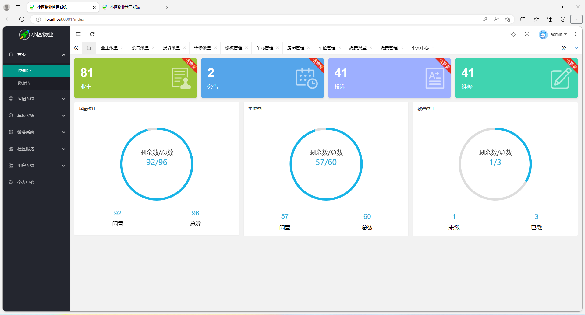
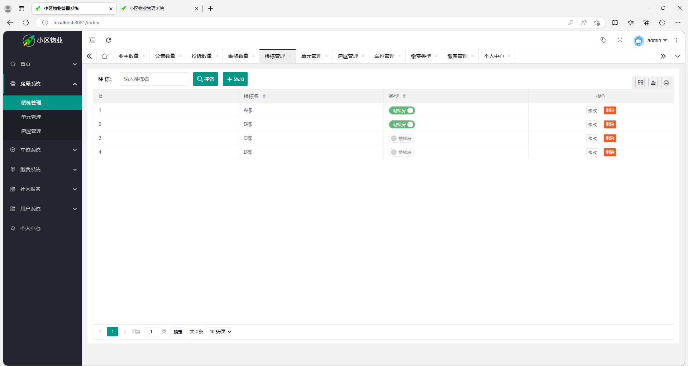
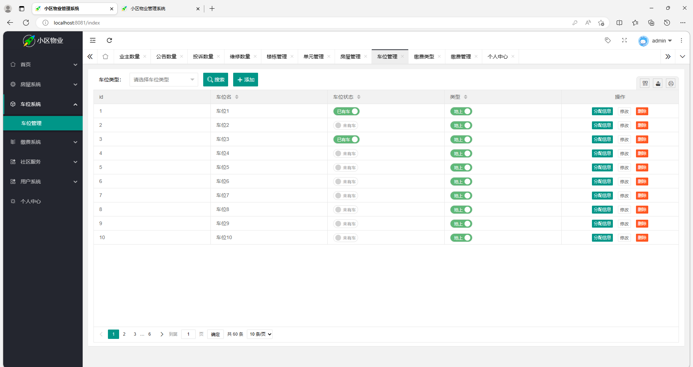
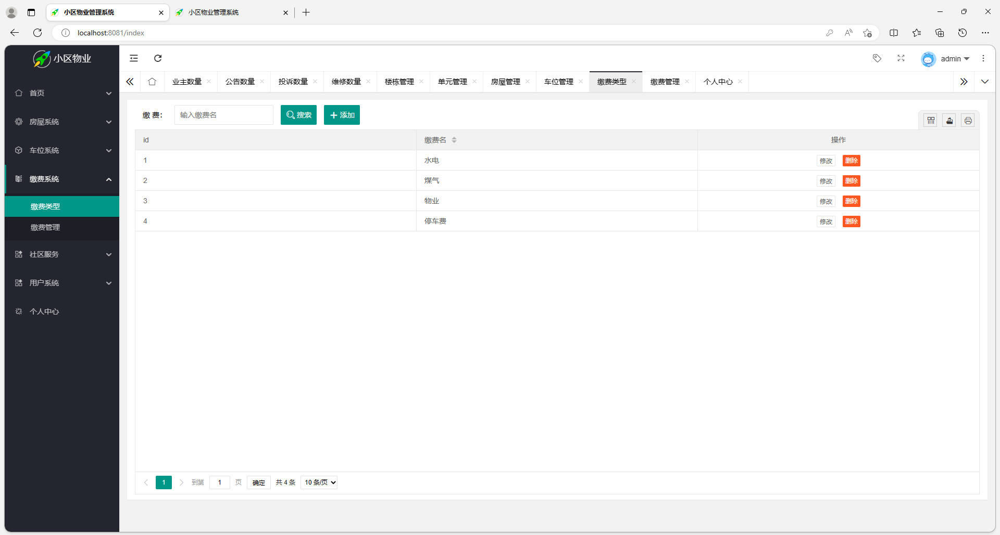
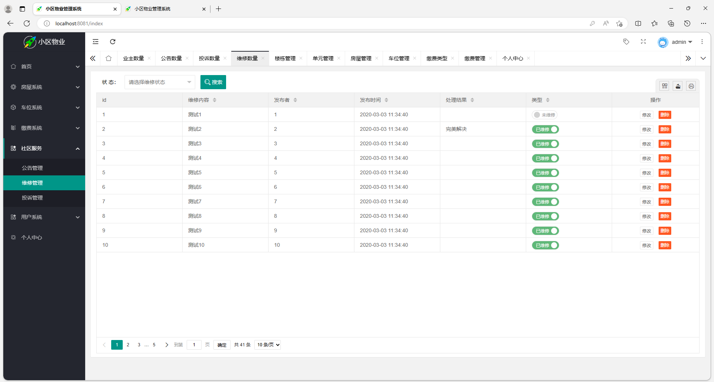
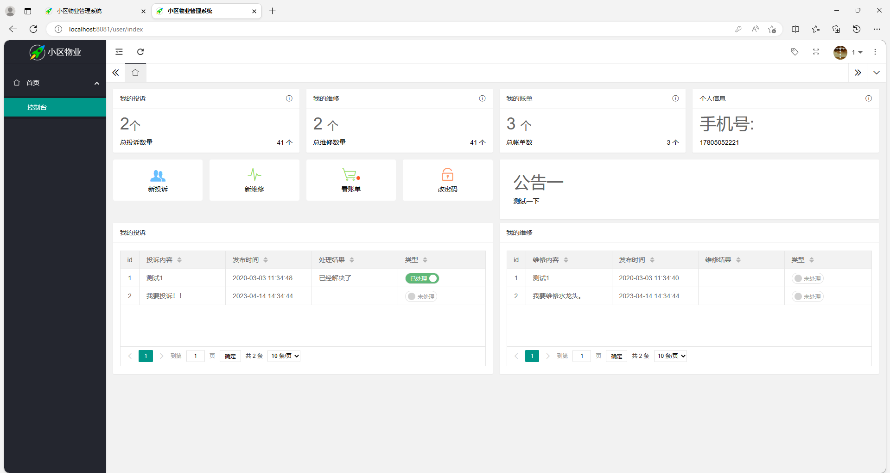
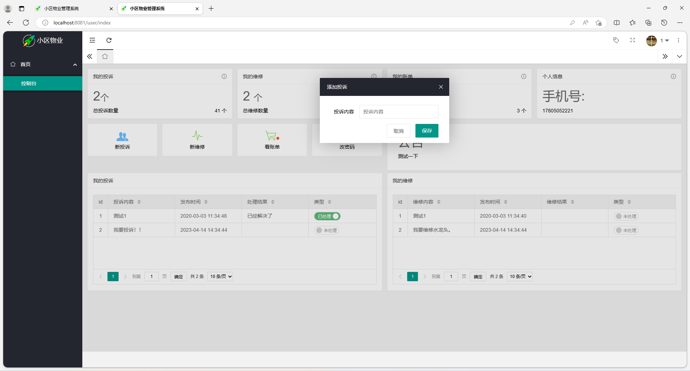

# 小区物业管理系统

## 一、介绍

运行环境:idea或eclipse 数据库:mysql

开发语言：java

基于springboot + mybatis + thymeleaf + Mysql的物业管理系统

技术栈：springboot + mybatis + thymeleaf + Mysql

角色：管理员和用户

控制台、数据库、楼栋管理、单元管理、房屋管理、车位管理、缴费类型、缴费管理、公告管理、维修管理、投诉管理、用户管理


## 二、系统部分功能截图

### 1、管理员模块部分功能界面截图











### 2、用户模块部分功能界面截图





## 三、视频演示

```
链接：https://pan.baidu.com/s/19XPaykp5bk7bpNyoH-v4aw?pwd=62yw

提取码：62yw

--来自百度网盘超级会员V6的分享
```

## 四、 9.9￥ 获取完整源码+sql，需要加Q：3808981644 备用Q：3577148218


